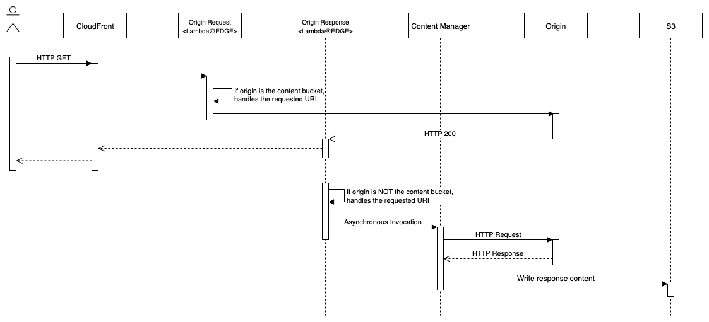

[](https://travis-ci.org/aws-samples/aws-serverless-replay-cache)

## AWS Serverless Replay Cache
AWS Serverless Replay Cache is a serverless implementation of cache solution for dynamic and static content using Lambda@Edge.


## Diagram



## Requirements
- Install: SAM CLI
- Setup: CloudFront
- Uninstall: AWS CLI

## Deploy SAM Application
```
sam deploy --stack-name replay-cache --s3-bucket <SAM_BUCKET_NAME> --capabilities CAPABILITY_NAMED_IAM --parameter-overrides BucketName=<CACHE_BUCKET_NAME>
```

## Configure CloudFront
1. Open the CloudFront console at https://console.aws.amazon.com/cloudfront
4. In the navigation panel select **Distributions**, and then click in the ID of the CloudFront Distribution to be configured
5. Under **Origins and Origin Groups** tab, click on **Create Origin** button
6. Origin Domain Name select the bucket specified in the parameter **<CACHE_BUCKET_NAME>** of SAM deployment
7. Bucket Access select **Yes**
8. Origin Access Identity select **Create a New Identity**
9. Grant Read Permissions Bucket select **Yes, Update Bucket Policy**
10. Click on **Create** button
11. Under **Origins and Origin Groups** tab, click on **Create Origin Group** button
12. Origins select the **website** Origin and click on **Add** button
13. Origins select the **S3 Cache Bucket** Origin and click on **Add** button
14. Failover criteria select all **5xx** errors
15. Origin Group ID enter **ReplayCache-OriginGroup**
16. Click on **Create** button
17. Under **Behaviors** tab, edit or create a new Behavior that will serve cached content in case of a failover
18. Origin or Origin Group select **ReplayCache-OriginGroup**
19. Click on **Create** or **Yes, Edit** button


## Deploy Origin Request Lambda@Edge
1. Open the Lambda console at https://console.aws.amazon.com/lambda
2. In the navigation panel select **Functions**, and then open **replay-cache-origin-request** function
3. Click on **Action** button and select **Deploy to Lambda@Edge** option
4. Select the appropriated Distribution and Behavior
5. CloudFront event select **Origin request**
6. Check the acknowledge checkbox
7. Click on **Deploy** button


## Deploy Origin Response Lambda@Edge
1. Open the Lambda console at https://console.aws.amazon.com/lambda
2. In the navigation panel select **Functions**, and then open **replay-cache-origin-response** function
3. Click on **Action** button and select **Deploy to Lambda@Edge** option
4. Select the appropriated Distribution and Behavior
5. CloudFront event select **Origin response**
6. Check the acknowledge checkbox
7. Click on **Deploy** button


## Uninstall
1. Remove Lambda@EDGE function associations
2. Empty S3 content bucket:
```
aws s3 rm s3://<CACHE_BUCKET_NAME> --recursive
```
3. Delete the CloudFormation Stack
```
aws cloudformation delete-stack --stack-name replay-cache
```

## License
This library is licensed under the MIT-0 License. See the LICENSE file.
